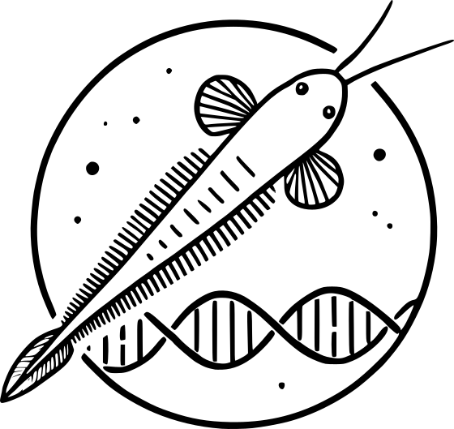

# The Amphioxus SLR Project



## Overview

The **Amphioxus SLR Project** aims to apply a novel tool, [SLRfinder](https://github.com/xuelingyi/SLRfinder), to identify sex-linked regions in *Amphioxus*. By leveraging this tool, we seek to gain insights into the mechanisms of sex determination in *Amphioxus* and contribute to a broader understanding of the diversification of sex-determination mechanisms in chordates.

## Environment Requirements

Ensure you have the following dependencies installed:

- **conda**: 25.1.1
- **snakemake**: 8.30.0
- **snakemake-executor-plugin-slurm**: 1.1.0

## Setup

Before running the workflow, activate the Snakemake environment containing snakemake and conda:

```sh
conda activate snakemake-8.30.0
```

The workflow was setup according to the best practices described in the [snakemake 8.30.0 documentation](https://snakemake.readthedocs.io/en/v8.3.0/).

```plaintext
├── README.md
├── .gitignore
├── config
│   └── config.yaml
├── data
│   ├── raw
│       └── amphioxus_variants.chr1.vcf.gz
│   └── metadata
│       ├── metadata.csv
│       └── reference.list
├── logs
│   ├── rule1
│   │   ├── rule1.err
│   │   ├── rule1.out
│   │   └── rule1_slurm.log
│   └── rule2
│       ├── rule2.err
│       ├── rule2.out
│       └── rule2_slurm.log
├── resources
│   └── amphioxus_logo.png
├── results
│   └── rule2
│       └── rule2_plot.PDF
└── workflow
    ├── Snakefile
    ├── envs
    │   ├── rule1.yaml
    │   └── rule2.yaml
    ├── rules
    │   ├── rule1.smk
    │   └── rule2.smk
    └── scripts
        ├── rule1
        └── rule2
            └── rule2_plot.r
```

## Running Snakemake

### Dry Run (Validation)

To perform a dry run and validate the workflow without executing commands:

```sh
snakemake --cores 1 -p --use-conda -n
```

### Cluster Execution

To simplify the execution on a cluster, a Snakemake profile was created for the SLURM scheduler:

```yaml
# curnagl/config.yaml
executor: slurm
jobs: 30
use-conda: true

default-resources:
  slurm_account: "mrobinso_evolseq"
  slurm_partition: "interactive"
  runtime: "30m"
  mem_mb: 2000
  cpus_per_task: 1
  threads: 1
```

The workflow can then be executed using:

```sh
snakemake -p --profile curnagl
```

The default resources can be overridden using the `--resources` flag, or by specifying the resources in the rule definition.

## Workflow Overview

TBD.
